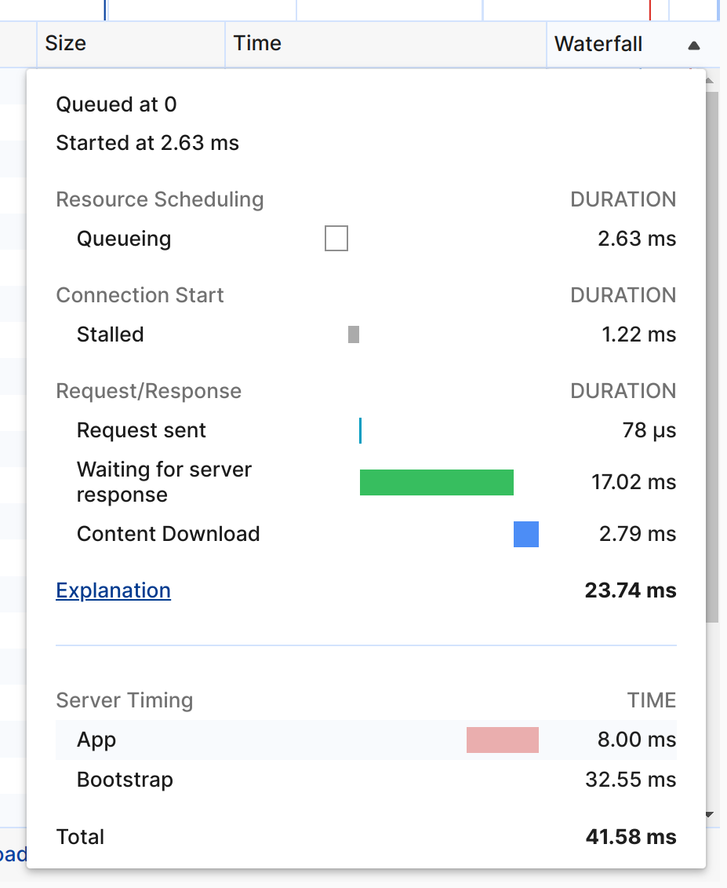

# A simple implementation of Server-Timing in Laravel.

[](https://packagist.org/packages/:vendor_slug/:package_slug)
[](https://github.com/:vendor_slug/:package_slug/actions?query=workflow%3Arun-tests+branch%3Amain)
[](https://github.com/:vendor_slug/:package_slug/actions?query=workflow%3A"Fix+PHP+code+style+issues"+branch%3Amain)
[](https://packagist.org/packages/:vendor_slug/:package_slug)

This package provides a simple implementation of the [Server-Timing](https://developer.mozilla.org/en-US/docs/Web/HTTP/Headers/Server-Timing) header in Laravel.

## Installation

You can install the package via composer:

```bash
composer require code-tieumomo/laravel-server-timing
```

## Usage

```php
return response()->json([])
    ->serverTiming([
        'bootstrap' => [
            'desc' => 'Bootstrap',
            'dur' => 32.552003860474,
        ],
        'app' => [
            'desc' => 'App',
            'dur' => 8,
        ],
        'total' => [
            'desc' => 'Total',
            'dur' => 41.576147079468,
        ],
    ]);
```

Or if you want to return a view:

```php
return response(view('work-orders.show', compact('workOrder')))
    ->serverTiming([
        'bootstrap' => [
            'desc' => 'Bootstrap',
            'dur' => 32.552003860474,
        ],
        'app' => [
            'desc' => 'App',
            'dur' => 8,
        ],
        'total' => [
            'desc' => 'Total',
            'dur' => 41.576147079468,
        ],
    ]);
```



## Testing

```bash
composer test
```

## Changelog

Please see [CHANGELOG](CHANGELOG.md) for more information on what has changed recently.

## Contributing

Please see [CONTRIBUTING](CONTRIBUTING.md) for details.

## Security Vulnerabilities

Please review [our security policy](../../security/policy) on how to report security vulnerabilities.

## Credits

- [code-tieumomo](https://github.com/code-tieumomo)
- [All Contributors](../../contributors)

## License

The MIT License (MIT). Please see [License File](LICENSE.md) for more information.
